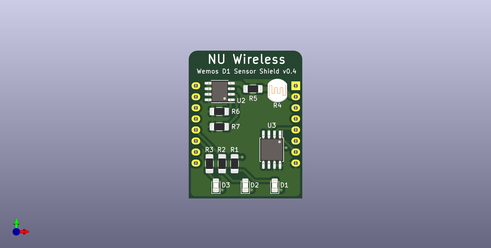

# Wemos D1 Mini Sensor Shield

To be used for a series of workshops given by the
Northeastern University Wireless Club.

Intended to be stacked on top of a Wemos D1 Mini. Contains temperature sensor,
photocell, SPI flash, and status LEDs.

